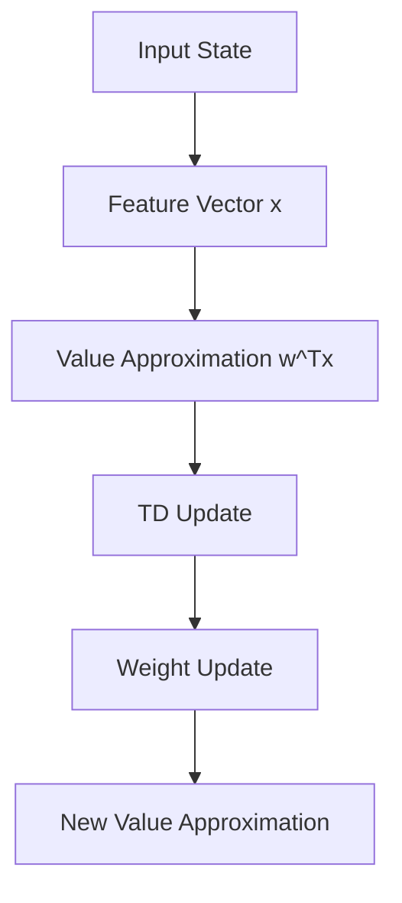

# Linear Temporal Difference

## 1. Core Concepts

Linear Temporal Difference (TD) is an extension of tabular TD that uses function approximation.

## 2. Semi-gradient TD Update

$$
w ← w + α[R + γw^Tx' - w^Tx]x
$$

Where:

- w = weight vector
- α = learning rate
- R = reward
- γ = discount factor
- x = feature vector for current state
- x' = feature vector for next state

## 3. Special Case: Tabular TD

Tabular TD is a special case where:

- Only one feature equals 1 (corresponding to current state)
- All other features are 0
- Value approximation equals weight of current state

## 4. Expected TD Update

<aside>
Expected update = b - Aw

</aside>

Where:

$$
A = E[x_t(x_t - γx_{t+1})^T]
$$

$$
b = E[R_tx_t]
$$

## 5. TD Fixed Point

At convergence:

$$
0 = b - Aw_{TD}
$$

If A is invertible:

$$
w_{TD} = A^{-1}b
$$

## 6. Relationship to Value Error

Important properties:

- TD fixed point differs from minimum value error solution
- Difference is large when γ (discount factor) is close to 1
- Difference is small when γ is close to 0

