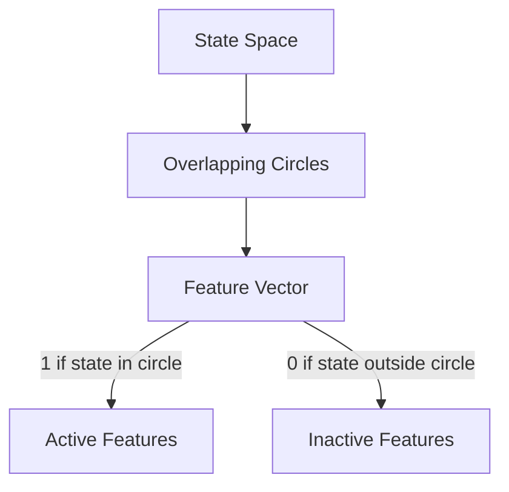
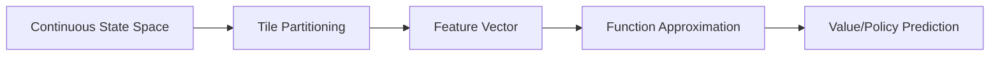

# Feature Construction for Linear Methods

## 1. Coarse Coding

An extension of state aggregation that allows overlapping shapes to represent states.

Key characteristics:

- Features have receptive fields that can overlap
- Nearby states share similar feature activations
- More flexible than traditional state aggregation

## 2. Discrimination vs. Generalization

### Discrimination

- Ability to distinguish between different states
- Captures fine-grained distinctions
- Risk: Overfitting if too discriminative

### Generalization

- Ability to apply learning to new situations
- Captures underlying patterns
- Risk: Underfitting if too general

## 3. Tile Coding

A method for efficiently representing high-dimensional state spaces through overlapping tiles.

<aside>
Key Components:

</aside>

- Non-overlapping tile partitioning of state space
- Unique identifiers for each tile
- Overlapping tile arrangements
- Feature vector representation

## 4. Implementation in TD Learning

Process flow:

1. State observation
2. Conversion to tile-coded feature vector
3. Input to function approximator
4. Value function or policy estimation

<aside>
Benefits:

</aside>

- Efficient representation of high-dimensional spaces
- Balance between granularity and generalization
- Effective compression of state space
- Preserves important state information