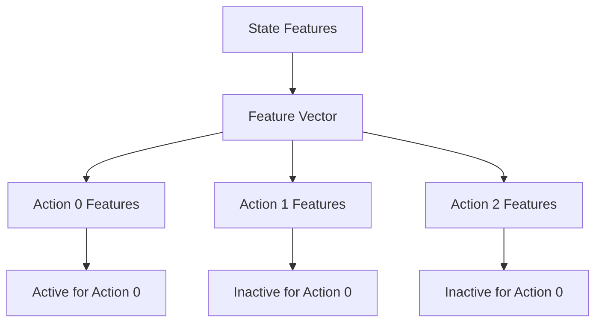

# Episodic Sarsa with Function Approximation

## 1. Action-Value Function Approximation

Converting state-values to action-values requires representing both states and actions in the feature vector.

### Stacked Feature Representation

<aside>
Example with 4 state features and 3 actions:

</aside>

- Total feature vector length = 12 (4 features × 3 actions)
- Only features for selected action are active (non-zero)
- Other action features are set to zero

## 2. Computing Action Values

Action values are computed as dot products between weight segments and feature vectors:

$$
Q(s,a) = w_a^T x(s)
$$

Where:

- $w_a$ = weight vector segment for action a
- x(s) = feature vector for state s

## 3. Neural Network Implementation

### Multiple Output Approach

- One output per action value
- State features from last hidden layer
- Independent weights per action

### Single Output Approach

- Input both state and action
- Single output for Q-value
- Can be used with tile coding

## 4. Update Rules

<aside>
Sarsa Update:

</aside>

$$
w ← w + α[R + γQ(s',a') - Q(s,a)]∇Q(s,a)
$$

<aside>
Expected Sarsa Update:

</aside>

$$
w ← w + α[R + γ∑_a π(a|s')Q(s',a) - Q(s,a)]∇Q(s,a)
$$

<aside>
Q-Learning Update:

</aside>

$$
w ← w + α[R + γ max_a Q(s',a) - Q(s,a)]∇Q(s,a)
$$

## 5. Key Benefits

- Efficient representation of state-action pairs
- Handles continuous state spaces
- Enables generalization across similar states and actions
- Supports different update rules for different learning approaches