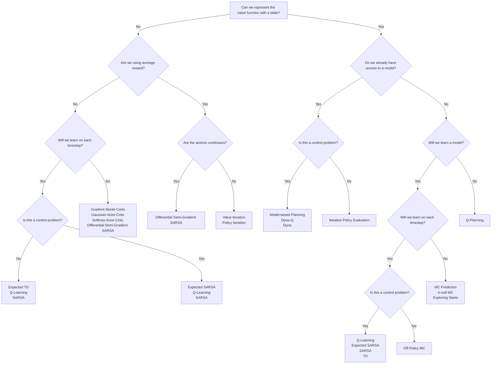

# Choosing the Learning Algorithm in Reinforcement Learning

## 1. Overview

Selecting the right learning algorithm is a crucial step in building a reinforcement learning (RL) system. The choice depends on the nature of the task, the available data, computational resources, and the required performance.

---

## 2. Key Factors in Algorithm Selection

- **Task Type:**  
  Is the task episodic or continuing?
- **State and Action Spaces:**  
  Are state and action spaces discrete or continuous? Are they small enough for tabular methods, or do they require function approximation?
- **Exploration Requirements:**  
  How important is exploration versus exploitation?
- **Computational Constraints:**  
  What are the time and resource limitations?
- **Learning Objective:**  
  Are you optimizing for discounted return, average reward, or another objective?

---

## 3. Common RL Algorithm Families

### Tabular Methods

- Suitable for small, discrete state and action spaces.
- Examples: Tabular Q-learning, Tabular Sarsa.

### Value-Based Methods

- Learn value functions (state-value or action-value) and derive policies from them.
- Examples: Q-learning, Deep Q-Networks (DQN).

### Policy-Based Methods

- Learn parameterized policies directly.
- Examples: REINFORCE, Policy Gradient, Actor-Critic.

### Actor-Critic Methods

- Combine value-based and policy-based approaches.
- Examples: Advantage Actor-Critic (A2C), Deep Deterministic Policy Gradient (DDPG).

---

## 4. Algorithm Selection Flow

---

## 5. Example: Algorithm Selection Table

| Task Type  | State/Action Space | Exploration Needed | Recommended Algorithm     |
| ---------- | ------------------ | ------------------ | ------------------------- |
| Episodic   | Small/Discrete     | Moderate           | Tabular Sarsa, Q-learning |
| Continuing | Large/Continuous   | High               | Actor-Critic, DDPG        |
| Episodic   | Large/Continuous   | Moderate           | DQN, Policy Gradient      |

---

## 6. Key Formulas

### Q-Learning Update

$$
Q(s_t, a_t) \leftarrow Q(s_t, a_t) + \alpha \left[ R_{t+1} + \gamma \max_{a'} Q(s_{t+1}, a') - Q(s_t, a_t) \right]
$$

### Policy Gradient Update

$$
\theta \leftarrow \theta + \alpha \nabla_\theta \log \pi_\theta(a_t \mid s_t) G_t
$$

---

## 7. Key Takeaways

- The choice of RL algorithm depends on the task structure, the size and type of state/action spaces, and computational constraints.
- Tabular methods are simple and effective for small problems; function approximation is needed for larger or continuous spaces.
- Value-based, policy-based, and actor-critic methods each have strengths and are suited to different scenarios.
- Using a flowchart or decision table can help systematically select the most appropriate algorithm for your RL project.
