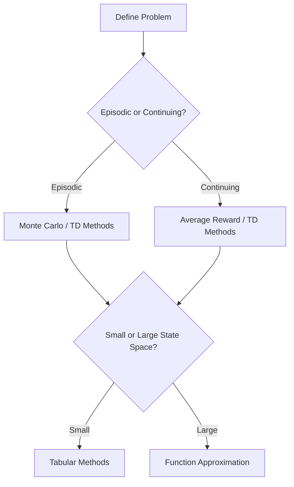

# Let's Review: Expected Sarsa

## Summary

Expected Sarsa is a temporal-difference (TD) control algorithm that blends the strengths of Sarsa and Q-learning. Instead of using the value of the next action actually taken (as in Sarsa), Expected Sarsa uses the expected value over all possible next actions, weighted by the policy's probability of selecting each action. This makes the update less noisy and more stable, especially with stochastic policies.

**Expected Sarsa Update Formula:**

$$
Q(s, a) \leftarrow Q(s, a) + \alpha \left[ r + \gamma \sum_{a'} \pi(a'|s') Q(s', a') - Q(s, a) \right]
$$

- It can be used for both on-policy and off-policy learning.
- Q-learning is a special case of Expected Sarsa where the policy is greedy.
- Expected Sarsa often leads to safer, more robust learning, especially in environments with risky or stochastic transitions.

---

# Let's Review: What is Q-learning?

## Summary

Q-learning is a foundational off-policy TD control algorithm in reinforcement learning. It learns the optimal action-value function by updating Q-values using the maximum estimated value for the next state, regardless of the agent's actual behavior. This enables Q-learning to learn optimal policies even while following an exploratory (e.g., epsilon-greedy) policy.

**Q-learning Update Formula:**

$$
Q(s, a) \leftarrow Q(s, a) + \alpha \left[ r + \gamma \max_{a'} Q(s', a') - Q(s, a) \right]
$$

- Q-learning is model-free and does not require knowledge of the environment's dynamics.
- It is guaranteed to converge to the optimal policy under certain conditions (sufficient exploration, decaying learning rate).
- Q-learning is widely used in both tabular and deep RL settings (e.g., Deep Q-Networks).

---

# Let's Review: Average Reward—A New Way of Formulating Control Problems

## Summary

Average reward is an alternative to the discounted reward framework, particularly suitable for continuing tasks without natural episodes. Instead of maximizing the sum of discounted rewards, the agent seeks to maximize the long-term average reward per time step.

**Average Reward Objective:**

$$
\bar{r}_\pi = \lim_{T \to \infty} \frac{1}{T} \mathbb{E}_\pi \left[ \sum_{t=1}^T R_t \right]
$$

- This approach is more natural for ongoing, infinite-horizon tasks.
- The average reward formulation leads to different value functions and learning algorithms (e.g., differential value functions).
- Algorithms like Differential Sarsa and Average Reward Actor-Critic are designed for this setting.

---

# Let's Review: Actor-Critic Algorithm

## Summary

The Actor-Critic algorithm combines policy-based and value-based reinforcement learning. The **actor** updates the policy parameters to select better actions, while the **critic** evaluates the current policy by estimating value functions.

**Core Steps:**

1. The critic computes the TD error:
   
   $$
   \delta_t = r_{t+1} + \gamma v_w(s_{t+1}) - v_w(s_t)
   $$

2. The critic updates its value function parameters $w$:
   
   $$
   w \leftarrow w + \alpha_c \delta_t \nabla_w v_w(s_t)
   $$

3. The actor updates its policy parameters $\theta$:
   
   $$
   \theta \leftarrow \theta + \alpha_a \delta_t \nabla_\theta \log \pi_\theta(a_t | s_t)
   $$
- Actor-Critic methods are efficient for large or continuous state and action spaces.
- They can be extended to use average reward, eligibility traces, and deep neural networks.

---

# Csaba Szepesvari on Problem Landscape

## Summary

This talk explores the diverse landscape of RL problems and the importance of matching algorithms to problem types. Key considerations include the structure of the environment (episodic vs. continuing, deterministic vs. stochastic), the size and type of state/action spaces, and the nature of the reward signal.

**Key Points:**

- There is no one-size-fits-all RL algorithm; the right choice depends on the problem's characteristics.
- Understanding the task structure helps in selecting between value-based, policy-based, and hybrid methods.
- Practical RL requires balancing exploration, exploitation, and computational resources.

**Mermaid Diagram:**

---

# Andy and Rich: Advice for Students

## Summary

Andy Barto and Rich Sutton share advice for students learning reinforcement learning:

- **Embrace Experimentation:** Try different algorithms and approaches; hands-on experimentation is key to understanding RL.
- **Understand Fundamentals:** Grasp the basics of value functions, policies, and the Bellman equation before diving into advanced topics.
- **Be Patient:** RL can be challenging and results may take time to appear. Persistence and incremental progress are important.
- **Collaborate and Discuss:** Engage with peers and the RL community to share ideas and troubleshoot problems.
- **Stay Curious:** The field is evolving rapidly; keep learning and exploring new developments.

---
