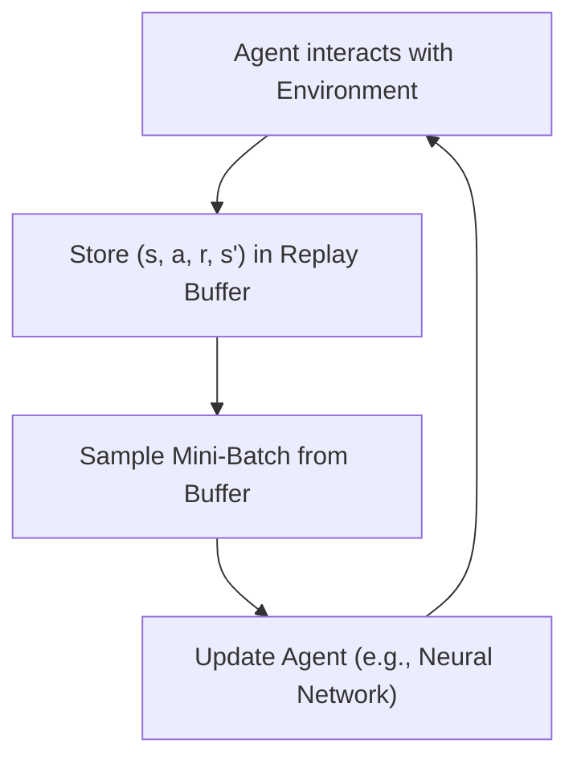
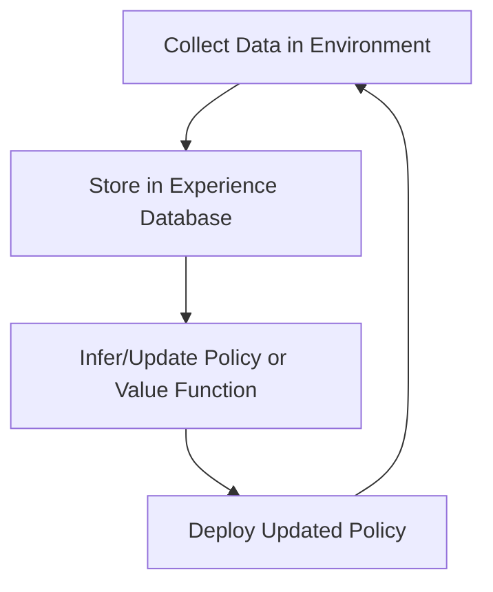

# Let's Review: Optimization Strategies for Neural Networks

## Summary

Optimizing neural networks is essential for effective learning in both supervised and reinforcement learning. Key strategies include:

-   **Choice of Optimizer:** Common optimizers are SGD (Stochastic Gradient Descent), RMSProp, Adam, and Momentum. Each has strengths for different problem types and data distributions.
-   **Learning Rate Scheduling:** Adjusting the learning rate over time (e.g., step decay, exponential decay) can help achieve faster convergence and avoid local minima.
-   **Batch Size:** Mini-batch training balances stability and speed. Small batches add noise (helpful for escaping local minima), while large batches provide more stable updates.
-   **Data Shuffling:** Randomizing the order of training data each epoch prevents the network from learning spurious patterns.
-   **Regularization:** Techniques like dropout and weight decay prevent overfitting and improve generalization.
-   **Gradient Clipping:** Prevents exploding gradients, especially in deep or recurrent networks.

These strategies are often combined and tuned for the specific problem and dataset.

---

# Let's Review: Expected Sarsa with Function Approximation

## Summary

Expected Sarsa can be extended to use function approximation, enabling learning in large or continuous state-action spaces. The key idea is to compute the expected value of the next state's action-values under the target policy, using a parameterized function (e.g., linear or neural network) to estimate $Q(s, a; w)$.

**Update Rule:**

$$
w \leftarrow w + \alpha \left[ r + \gamma \sum_{a'} \pi(a'|s') Q(s', a'; w) - Q(s, a; w) \right] \nabla_w Q(s, a; w)
$$

-   The TD target is the expected value, not a sample.
-   The gradient is taken with respect to the weights $w$.
-   This approach reduces variance and can be more stable than sample-based methods, especially with stochastic policies.

---

# Let's Review: Dyna-Q Learning in a Simple Maze

## Summary

Dyna-Q is a hybrid RL algorithm that combines model-free learning (like Q-learning) with model-based planning. The agent learns from real experience and also simulates additional experiences using a learned model of the environment.

**Key Steps:**

1. **Direct RL Update:** Update Q-values from actual experience.
2. **Model Learning:** Update the model of the environment with observed transitions.
3. **Planning:** Simulate experiences using the model and update Q-values accordingly.

**Dyna-Q Algorithm Skeleton:**

-   For each real step:
    -   Update Q-table with observed $(s, a, r, s')$.
    -   Update model with $(s, a, r, s')$.
    -   For $n$ planning steps:
        -   Sample $(\hat{s}, \hat{a})$ from past experience.
        -   Simulate $(\hat{r}, \hat{s}')$ using the model.
        -   Update Q-table with simulated experience.

**Benefits:**

-   Faster learning by leveraging both real and simulated experience.
-   More efficient use of data, especially in environments where real samples are costly.

---

# Meeting with Martha: In-Depth on Experience Replay

## Summary

Experience replay is a technique that improves data efficiency and stability in RL, especially with neural networks. The agent stores past experiences in a replay buffer and samples mini-batches for learning.

**Key Points:**

-   **Replay Buffer:** Stores tuples $(s, a, r, s')$ from past interactions.
-   **Random Sampling:** Breaks correlations between sequential data and improves the stability of updates.
-   **Data Efficiency:** Allows multiple updates from the same experience, making better use of each sample.
-   **Prioritized Experience Replay:** Samples more important or surprising experiences more frequently, further improving learning speed.

**Mermaid Diagram:**

---

# Martin Riedmiller on the Collect-and-Infer Framework for Data-Efficient RL

## Summary

The Collect-and-Infer framework is designed to improve data efficiency in RL by separating data collection from policy inference and learning. This approach is particularly useful in real-world or costly environments.

**Key Points:**

-   **Collect Phase:** The agent gathers experience in the environment, possibly using a behavior policy different from the current target policy.
-   **Infer Phase:** The agent uses the collected data to update its policy or value function, often offline or asynchronously.
-   **Benefits:** Enables more stable and efficient learning, supports batch and off-policy learning, and is well-suited for distributed or parallelized RL systems.
-   **Applications:** Robotics, industrial control, and any setting where real-world data collection is expensive or slow.

**Mermaid Diagram:**

